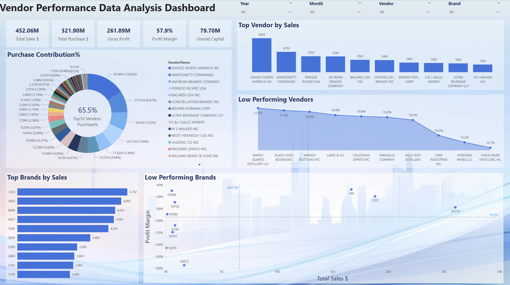

# 📦 Vendor Performance Data Analysis

Analyze vendor performance data to identify top- and low-performing vendors and brands, evaluate profitability, and provide data-driven recommendations.

---

## 📊 Dashboard Preview



---

## ⚡️ Key Highlights

- 💰 **Total Sales:** \$29.85M  
- 💵 **Total Purchases:** \$19.14M  
- 📈 **Gross Profit:** \$17.48M  
- 📊 **Profit Margin:** 58.6%
- 🏆 **Top 10 vendors contribute 62.9% of all purchases** → high concentration risk
- 🧐 Identified low-performing vendors & brands for optimization
- 📐 Performed correlation and confidence-interval analyses

---

## 🛠 Tech Stack

- **Languages:** Python (pandas, numpy, scipy, seaborn), SQL
- **Tools:** Jupyter Notebooks, Power BI Desktop

---

## 📁 Repository Structure

| Folder | Description |
|--------|-------------|
| [`Data_Analysis`](Data_Analysis) | Jupyter notebooks for EDA, statistical testing |
| [`Presentation`](Presentation) | Power BI dashboard (`.pbix`) with KPIs & drilldowns |
| [`Business_Report_and_Dashboard`](Business_Report_and_Dashboard) | Executive report (`.pdf`, `.docx`) and dashboard preview image |
| [`src`](src) | Python scripts for data ingestion, cleaning, and summary generation |

---

## 📌 How to Use

1. Clone the repository  
   ```bash
   git clone https://github.com/krystalyaoyufan1-cyber/Vendor-Performance-Data-Analysis-SQL-Python-Powerbi-PDF.git
